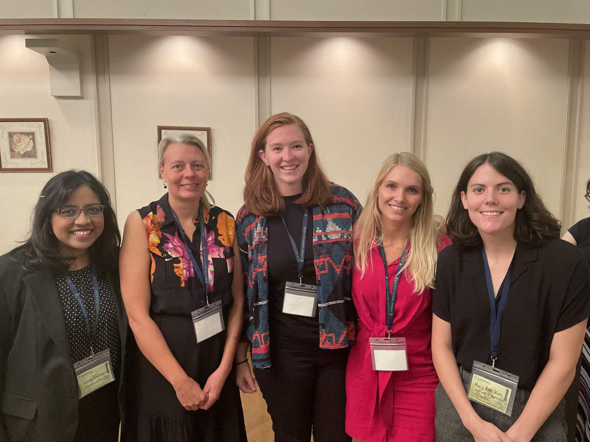
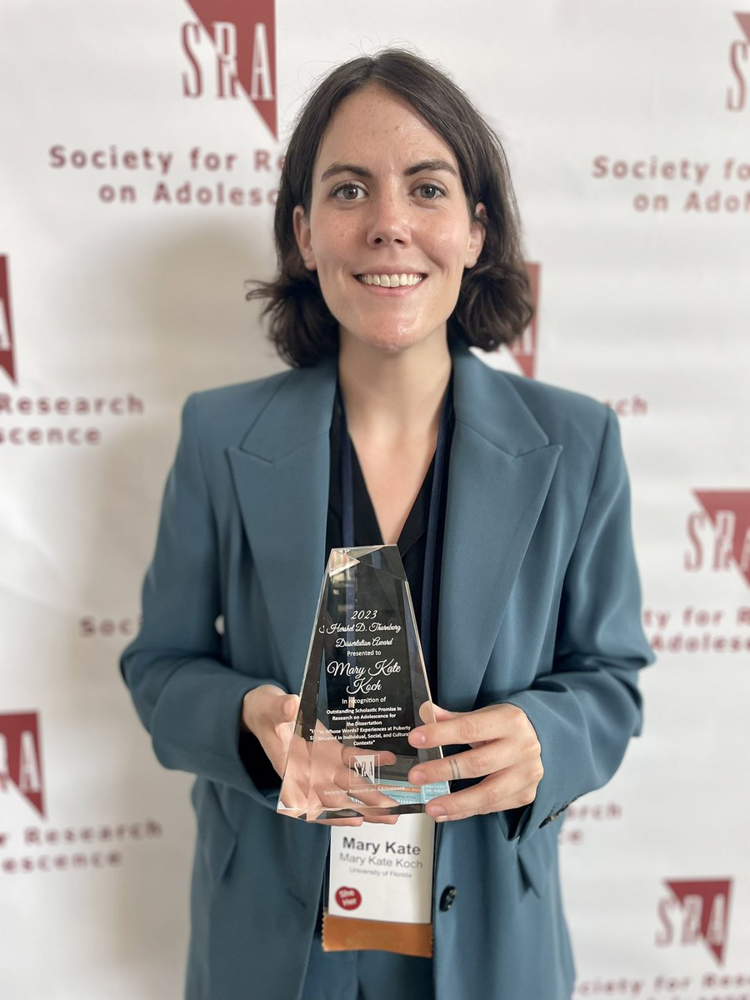

```{css echo=FALSE}
d-title h1 {
  color: var(--color-secondary);
}


/*-- edit if want to change heading sizes

.main {
  font-size: 12pt;
}
h2 {
  font-size: 18pt;
}

--*/

```

**<i class="fas fa-newspaper"></i> SPSSI Grant Awarded**

Grant application with Dr. Kayla Burd was funded by the Society for the Psychological Study of Social Issues to collaborate on researching maturation bias in School Resource Officers. You can learn more about the proposed study on our OSF pre-registration. [[Link]](https://osf.io/c58xu?mode=&revisionId=&view_only=)

**<i class="fas fa-comment"></i> SARAMC 2023 in Nagoya, Japan**

Presented on developmental differences in legacy narration at SARMAC 2023


**<i class="fas fa-newspaper"></i> Won the 2023 Hershel D. Thornburg Dissertation Award from the Society of Research on Adolescence [[Link]](https://annualmeeting.s-r-a.org/2023-award-winners) **


**<i class="fas fa-pencil-alt"></i> Featured Research on the Child & Family Blog**

My research on what girls think and write about when we ask them about their experiences with puberty was spotlighted by a parenting blog whose goal is to educate and inform parents using current research. The post covered what parents might expect their daughters to experience during puberty.
[[Link]](https://childandfamilyblog.com/what-is-puberty-like-for-girls/)

**<i class="fas fa-comment"></i> UF Postdoc Summer Series Featured Speaker**

**<i class="fas fa-newspaper"></i> Recognized as rising star at UF during national postdoc appreciation week [[Link]](https://news.ufl.edu/2022/09/postdoc-appreciation-week/)**

**<i class="fas fa-newspaper"></i> Featured graduate student research at Cornell University [[Link]](https://gradschool.cornell.edu/spotlights/student-spotlight-mary-kate-koch/)**

**<i class="fas fa-pencil-alt"></i> Featured Research on the Child & Family Blog**

My research on the potential benefits of writing about puberty for youth was highlighted by Cornell Extension to inform youth activity leaders, parents, and teachers about beneficial activities to do with their youth. [[Link]](https://pryde.bctr.cornell.edu/blog/2018/3/22/writing-and-sharing-writing-to-cope-with-pubertys-changes)


